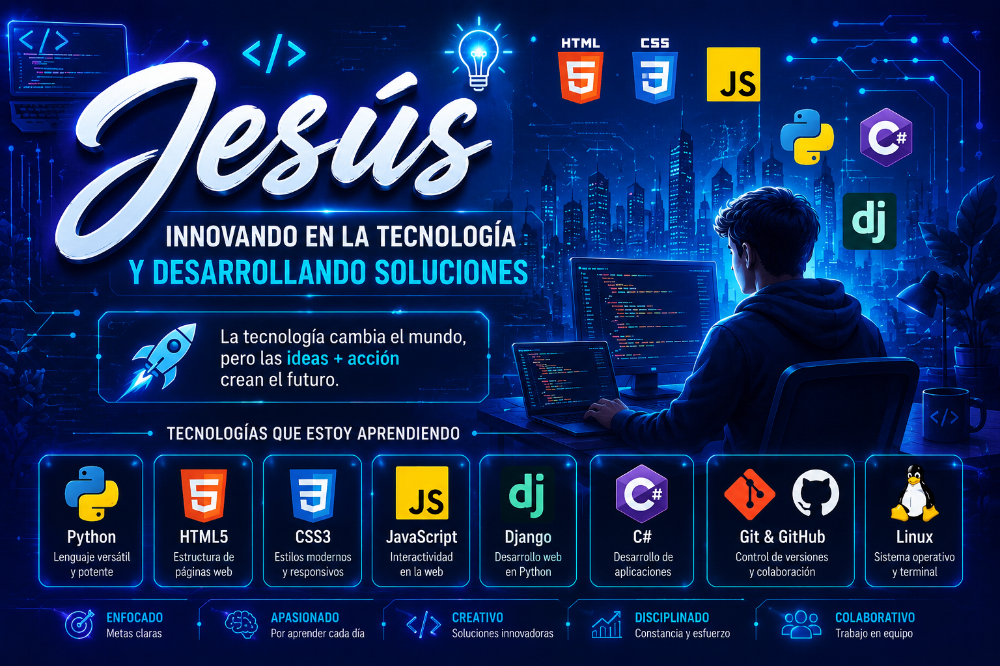

<h1 align="center">Hola, soy Jesús Francisco Granados Mora</h1>

  <strong>Desarrollador Backend Python Junior · Técnico en Redes</strong> 
  San José, Costa Rica

  <a href="https://ciscojes.github.io/">Portafolio</a> ·
  <a href="https://www.linkedin.com/in/jesus-granados-ba9aab1b4/">LinkedIn</a> ·
  <a href="https://github.com/Ciscojes?tab=repositories">Repositorios</a>

## Sobre mí

Estoy en transición profesional hacia el desarrollo de software. Desde 2019
trabajo como carpintero en AICON Edificadora, una trayectoria en la que he
fortalecido la precisión, la planificación, la responsabilidad y la atención al
detalle. Hoy aplico esas capacidades al desarrollo backend, las redes y la
construcción de proyectos tecnológicos funcionales.

Busco oportunidades como desarrollador backend Python junior, con disponibilidad
para trabajo remoto internacional y para posiciones remotas o híbridas en Costa
Rica.

## Proyectos destacados

### [JobRadar](https://github.com/Ciscojes/jobradar)

Plataforma SaaS multiusuario de alertas de empleo, desarrollada con FastAPI,
PostgreSQL y SQLAlchemy. Mi aporte se concentró en:

- Dashboard en Streamlit.
- Contenedorización con Docker.
- Pruebas automatizadas con Pytest y flujo de CI con GitHub Actions.
- Integración de notificaciones mediante Telegram.

### [Tutor HTML y CSS con Gemini](https://github.com/Ciscojes/tutor-css-gemini)

Aplicación educativa construida con JavaScript, Node.js y Express. Consulta
material propio de HTML y CSS, recupera fragmentos con SQLite FTS5 y utiliza
Gemini para responder con fuentes. Incluye extracción de PDF, OCR, actividades
de estudio, flashcards y seguimiento del progreso.

## Habilidades técnicas

- **Backend y datos:** Python, FastAPI, PostgreSQL, SQLAlchemy, Node.js y Express.
- **Calidad y entrega:** Docker, Pytest, Git, GitHub Actions y Linux.
- **Web:** JavaScript, HTML y Sass/CSS.
- **Infraestructura:** redes Cisco, routing, switching y ciberseguridad.
- **Inteligencia artificial:** Gemini, RAG, OCR, chatbots y agentes de IA.

## Formación

- **BIG School:** Máster en Desarrollo de Software con Inteligencia Artificial
  (en curso).
- **Conquer Blocks:** Programa de Desarrollo Web Full Stack (en curso).
- **Universidad Castro Carazo:** Técnico en Redes.
- **INA:** Ejecutivo en Inglés para Servicios.

## Contacto

- [Portafolio profesional](https://ciscojes.github.io/)
- [LinkedIn](https://www.linkedin.com/in/jesus-granados-ba9aab1b4/)
- [GitHub](https://github.com/Ciscojes)
